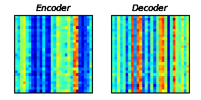
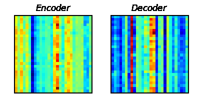
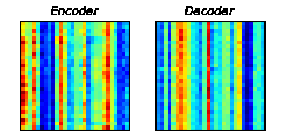
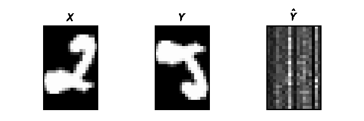
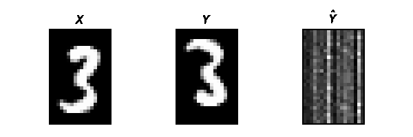
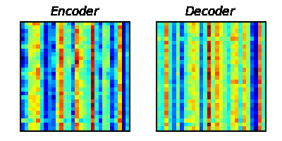
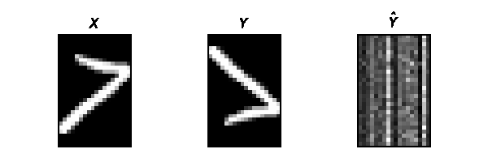
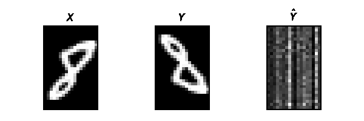
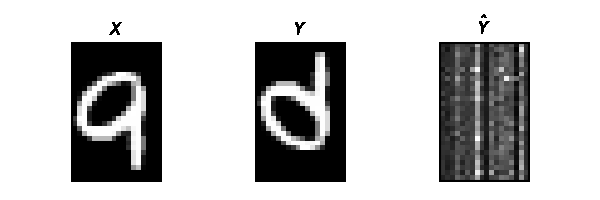

[TensorFlow 2] Attention is all you need (Transformer)
=====
TensorFlow implementation of "Attention is all you need (Transformer)"

## Dataset  

The MNIST dataset is used for confirming the working of the transformer.  
The dataset is processed as follows for regarding as a sequential form.  
* Trim off the sides from the square image.  
  * (H X W) -> (H X W_trim)  
    * H (Height) = W (Width) = 28  
    * W_trim = 18
  * The height axis is regarded as a sequence and the width axis is regarded as a feature of each sequence.  
      * (H X W) = (S X F)  
      * S (Sequence) = 28  
      * F (Feature) = 18  
* Specify the target Y as an inverse sequence of X to differentiate the input sequence from the target sequence.  
  * In the figure, the data is shown in an upside-down form.  

## Results

### Training  

    

### Generation  

<table>
  <tr>
    <td><strong>Class</strong></td>
    <td><strong>Attention Map</strong></td>
    <td><strong>Reconstruction</strong></td>
  </tr>
  <tr>
    <td>0</td>
    <td></td>
    <td></td>
  </tr>
  <tr>
    <td>1</td>
    <td></td>
    <td></td>
  </tr>
  <tr>
    <td>2</td>
    <td></td>
    <td></td>
  </tr>
  <tr>
    <td>3</td>
    <td></td>
    <td></td>
  </tr>
  <tr>
    <td>4</td>
    <td></td>
    <td></td>
  </tr>
  <tr>
    <td>5</td>
    <td></td>
    <td></td>
  </tr>
  <tr>
    <td>6</td>
    <td></td>
    <td></td>
  </tr>
  <tr>
    <td>7</td>
    <td></td>
    <td></td>
  </tr>
  <tr>
    <td>8</td>
    <td></td>
    <td></td>
  </tr>
  <tr>
    <td>9</td>
    <td></td>
    <td></td>
  </tr>
</table>

## Requirements
* Tensorflow 2.4.0  
* <a>whiteboxlayer</a> 0.2.1

## Reference
[1] Vaswani, Ashish, et al. <a href="https://arxiv.org/abs/1706.03762">Attention is all you need.</a> Advances in neural information processing systems. 2017.
